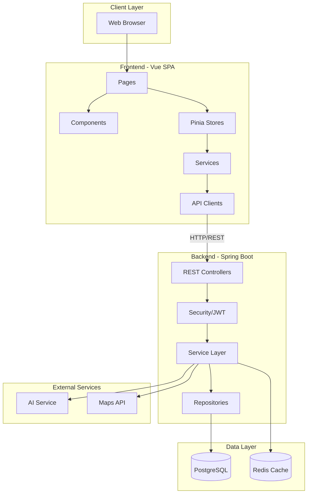
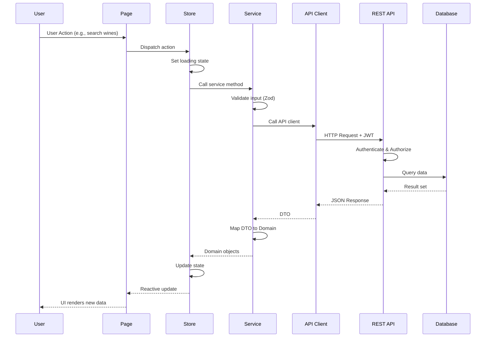
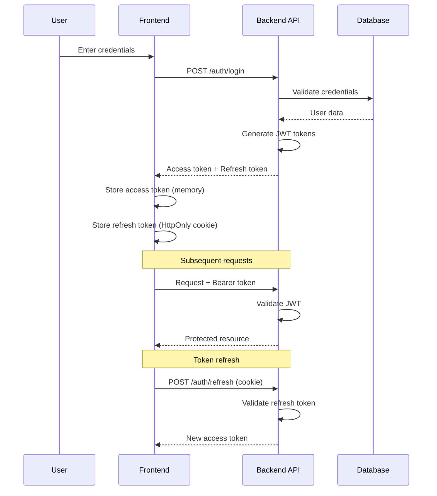

# Rewine Architecture

This document provides a comprehensive overview of the Rewine platform architecture, covering both the current frontend implementation and the planned backend infrastructure.

---

## Table of Contents

1. [System Overview](#system-overview)
2. [Frontend Architecture](#frontend-architecture)
3. [Backend Architecture (Planned)](#backend-architecture-planned)
4. [Infrastructure (Planned)](#infrastructure-planned)
5. [Observability Plan](#observability-plan)
6. [Architecture Diagrams](#architecture-diagrams)

---

## System Overview

Rewine follows a modern **client-server architecture** with clear separation between the frontend Single Page Application (SPA) and the backend REST API.

### System Boundaries

```
┌─────────────────────────────────────────────────────────────────────────────┐
│                              REWINE PLATFORM                                 │
├─────────────────────────────────────────────────────────────────────────────┤
│                                                                              │
│  ┌────────────────┐     ┌────────────────┐     ┌────────────────┐          │
│  │    Frontend    │────▶│   REST API     │────▶│   PostgreSQL   │          │
│  │   (Vue SPA)    │◀────│ (Spring Boot)  │◀────│   Database     │          │
│  └────────────────┘     └────────────────┘     └────────────────┘          │
│         │                      │                                            │
│         │                      │                                            │
│         ▼                      ▼                                            │
│  ┌────────────────┐     ┌────────────────┐                                 │
│  │   CDN/Nginx    │     │   Redis Cache  │                                 │
│  │  (Static SPA)  │     │   (Sessions)   │                                 │
│  └────────────────┘     └────────────────┘                                 │
│                                                                              │
└─────────────────────────────────────────────────────────────────────────────┘
```

### Data Flow

1. **User** interacts with the **Vue SPA** in the browser
2. **Frontend** sends HTTP requests to the **REST API**
3. **API** processes requests, applies business logic
4. **API** reads/writes data to **PostgreSQL**
5. **API** returns JSON responses to the **Frontend**
6. **Frontend** updates UI based on response

---

## Frontend Architecture

The frontend follows a **layered architecture** inspired by Clean Architecture and Domain-Driven Design principles.

### Layer Overview

```
┌─────────────────────────────────────────────────────────────────┐
│                        PRESENTATION                              │
│  ┌─────────┐  ┌─────────┐  ┌─────────┐  ┌─────────┐            │
│  │  Pages  │  │Components│  │ Layout  │  │Feedback │            │
│  └────┬────┘  └────┬────┘  └────┬────┘  └────┬────┘            │
├───────┼────────────┼────────────┼────────────┼──────────────────┤
│       │            │            │            │                   │
│       └────────────┴────────────┴────────────┘                   │
│                          │                                       │
│                          ▼                                       │
│  ┌─────────────────────────────────────────────────────────┐    │
│  │                  APPLICATION LAYER                       │    │
│  │  ┌──────────┐  ┌──────────┐  ┌──────────┐              │    │
│  │  │  Stores  │  │ Services │  │Composables│              │    │
│  │  └────┬─────┘  └────┬─────┘  └─────┬────┘              │    │
│  └───────┼─────────────┼──────────────┼─────────────────────┘    │
│          │             │              │                          │
├──────────┼─────────────┼──────────────┼──────────────────────────┤
│          ▼             ▼              │                          │
│  ┌─────────────────────────────────────────────────────────┐    │
│  │                    DOMAIN LAYER                          │    │
│  │  ┌──────────┐  ┌──────────┐  ┌──────────┐              │    │
│  │  │  Types   │  │ Mappers  │  │Validators│              │    │
│  │  └──────────┘  └──────────┘  └──────────┘              │    │
│  └─────────────────────────────────────────────────────────┘    │
│                          │                                       │
├──────────────────────────┼───────────────────────────────────────┤
│                          ▼                                       │
│  ┌─────────────────────────────────────────────────────────┐    │
│  │                 INFRASTRUCTURE LAYER                     │    │
│  │  ┌──────────┐  ┌──────────┐  ┌──────────┐              │    │
│  │  │API Clients│  │   DTOs   │  │HTTP/Axios│              │    │
│  │  └──────────┘  └──────────┘  └──────────┘              │    │
│  └─────────────────────────────────────────────────────────┘    │
│                                                                  │
└──────────────────────────────────────────────────────────────────┘
```

### Folder Responsibilities

| Folder | Layer | Responsibility |
|--------|-------|----------------|
| `src/app/` | Bootstrap | Application entry point, router, Pinia, Axios config, auth bootstrap |
| `src/config/` | Configuration | Routes definitions, navigation config, constants, feature flags |
| `src/pages/` | Presentation | Route-level Vue components (views) |
| `src/components/` | Presentation | Reusable UI components (common, layout, feedback) |
| `src/domain/` | Domain | Business types, mappers (DTO→Domain), Zod validators |
| `src/api/` | Infrastructure | API clients, DTOs, shared API types |
| `src/services/` | Application | Use-case orchestration, calls API clients, maps to domain |
| `src/stores/` | Application | Pinia stores for global state management |
| `src/composables/` | Application | Reusable composition functions (hooks) |
| `src/utils/` | Shared | Pure utility functions (date, string, validation helpers) |
| `src/i18n/` | Infrastructure | Internationalization setup and locale files |
| `src/mocks/` | Infrastructure | MSW handlers for API mocking in development |
| `src/directives/` | Presentation | Custom Vue directives |
| `src/assets/` | Static | Styles, images processed by Vite |

### Key Principles

1. **Unidirectional Data Flow**: User Action → Store → API → State Update → UI
2. **Domain Isolation**: Business logic lives in `/domain`, independent of UI
3. **Single Source of Truth**: All shared state in Pinia stores
4. **Dependency Inversion**: Pages depend on services/stores, not on API clients directly

---

## Backend Architecture (Planned)

The backend will follow a **layered Spring Boot architecture** with clear separation of concerns.

### Layer Structure

```
backend/
├── src/main/java/com/rewine/
│   ├── RewineApplication.java          # Spring Boot entry point
│   │
│   ├── config/                          # Configuration classes
│   │   ├── SecurityConfig.java         # Spring Security setup
│   │   ├── CorsConfig.java             # CORS configuration
│   │   ├── WebConfig.java              # Web MVC config
│   │   └── OpenApiConfig.java          # Swagger/OpenAPI setup
│   │
│   ├── controller/                      # REST Controllers (HTTP layer)
│   │   ├── AuthController.java
│   │   ├── WineController.java
│   │   ├── EventController.java
│   │   ├── WineRouteController.java
│   │   └── UserController.java
│   │
│   ├── service/                         # Business Logic layer
│   │   ├── AuthService.java
│   │   ├── WineService.java
│   │   ├── EventService.java
│   │   ├── WineRouteService.java
│   │   └── UserService.java
│   │
│   ├── repository/                      # Data Access layer (Spring Data JPA)
│   │   ├── WineRepository.java
│   │   ├── EventRepository.java
│   │   ├── WineRouteRepository.java
│   │   └── UserRepository.java
│   │
│   ├── entity/                          # JPA Entities (Database models)
│   │   ├── Wine.java
│   │   ├── Event.java
│   │   ├── WineRoute.java
│   │   └── User.java
│   │
│   ├── dto/                             # Data Transfer Objects
│   │   ├── request/                    # Incoming request DTOs
│   │   └── response/                   # Outgoing response DTOs
│   │
│   ├── mapper/                          # Entity ↔ DTO mappers (MapStruct)
│   │   ├── WineMapper.java
│   │   ├── EventMapper.java
│   │   └── UserMapper.java
│   │
│   ├── security/                        # Security components
│   │   ├── JwtTokenProvider.java
│   │   ├── JwtAuthenticationFilter.java
│   │   └── UserDetailsServiceImpl.java
│   │
│   ├── exception/                       # Exception handling
│   │   ├── GlobalExceptionHandler.java
│   │   ├── ResourceNotFoundException.java
│   │   └── UnauthorizedException.java
│   │
│   └── util/                            # Utility classes
│
├── src/main/resources/
│   ├── application.yml                  # Main configuration
│   ├── application-dev.yml             # Dev profile
│   ├── application-prod.yml            # Prod profile
│   └── db/migration/                    # Flyway migrations
│       ├── V1__initial_schema.sql
│       └── V2__add_indexes.sql
│
└── src/test/                            # Test sources
```

### Database Schema (Planned)

```
┌──────────────┐     ┌──────────────┐     ┌──────────────┐
│    users     │     │    wines     │     │   reviews    │
├──────────────┤     ├──────────────┤     ├──────────────┤
│ id (PK)      │     │ id (PK)      │     │ id (PK)      │
│ email        │     │ name         │     │ wine_id (FK) │
│ password     │     │ winery       │     │ user_id (FK) │
│ name         │     │ type         │     │ rating       │
│ roles        │     │ region       │     │ comment      │
│ created_at   │     │ vintage      │     │ created_at   │
└──────────────┘     │ price        │     └──────────────┘
       │             │ created_at   │            │
       │             └──────────────┘            │
       │                    │                    │
       └────────────────────┼────────────────────┘
                            │
┌──────────────┐     ┌──────────────┐     ┌──────────────┐
│   events     │     │ wine_routes  │     │   cellars    │
├──────────────┤     ├──────────────┤     ├──────────────┤
│ id (PK)      │     │ id (PK)      │     │ id (PK)      │
│ title        │     │ name         │     │ user_id (FK) │
│ description  │     │ description  │     │ wine_id (FK) │
│ type         │     │ region       │     │ quantity     │
│ start_date   │     │ stops (JSON) │     │ added_at     │
│ location     │     │ created_at   │     └──────────────┘
│ organizer_id │     └──────────────┘
└──────────────┘
```

---

## Infrastructure (Planned)

### Containerization

```dockerfile
# Backend Dockerfile (planned)
FROM eclipse-temurin:21-jre-alpine
WORKDIR /app
COPY target/*.jar app.jar
EXPOSE 8080
ENTRYPOINT ["java", "-jar", "app.jar"]
```

### Kubernetes Deployment

```yaml
# Planned deployment structure
k8s/
├── base/
│   ├── frontend-deployment.yaml
│   ├── backend-deployment.yaml
│   ├── postgres-statefulset.yaml
│   └── ingress.yaml
├── overlays/
│   ├── dev/
│   ├── uat/
│   └── prod/
└── kustomization.yaml
```

### CI/CD Pipeline (Jenkins)

```
┌─────────┐    ┌─────────┐    ┌─────────┐    ┌─────────┐    ┌─────────┐
│  Build  │───▶│  Test   │───▶│  Scan   │───▶│  Push   │───▶│ Deploy  │
│         │    │         │    │ (Sonar) │    │ (Image) │    │  (K8s)  │
└─────────┘    └─────────┘    └─────────┘    └─────────┘    └─────────┘
```

Pipeline stages:
1. **Build**: Compile frontend/backend
2. **Test**: Run unit and integration tests
3. **Scan**: SonarQube quality gate
4. **Push**: Build and push Docker images
5. **Deploy**: Deploy to target environment

---

## Observability Plan

### Logging

- **Frontend**: Console logs in development, structured JSON in production
- **Backend**: Logback with JSON output for aggregation
- **Log Levels**: ERROR, WARN, INFO, DEBUG (configurable per environment)

### Metrics

- **Backend**: Micrometer + Prometheus endpoint (`/actuator/prometheus`)
- **Key Metrics**:
  - Request rate, latency, error rate (RED)
  - JVM metrics (heap, GC, threads)
  - Custom business metrics (wines viewed, reviews created)

### Tracing

- **Distributed Tracing**: OpenTelemetry integration
- **Correlation IDs**: Propagated from frontend to backend
- **Span Context**: Request → Service → Repository

### Monitoring Stack

```
┌────────────┐     ┌────────────┐     ┌────────────┐
│ Prometheus │────▶│  Grafana   │────▶│   Alerts   │
│  (Scrape)  │     │ (Dashboards)│    │ (PagerDuty)│
└────────────┘     └────────────┘     └────────────┘
       │
       ▼
┌────────────┐     ┌────────────┐
│   Loki     │────▶│   Grafana  │
│   (Logs)   │     │  (Explore) │
└────────────┘     └────────────┘
```

---

## Architecture Diagrams

### Component Diagram



### Request Flow Diagram



### Authentication Flow



---

## Related Documentation

- [Frontend Guide](FRONTEND.md) - Detailed frontend development guide
- [Backend Architecture](../backend/ARCHITECTURE.md) - Backend architecture details
- [Security](SECURITY.md) - Security implementation details
- [Credentials & Accounts](./CREDENTIALS_AND_ACCOUNTS.md) - Environment variables, API keys, test users
- [Environments](ENVIRONMENTS.md) - Environment configuration
- [Troubleshooting](./TROUBLESHOOTING.md) - Common issues and solutions

